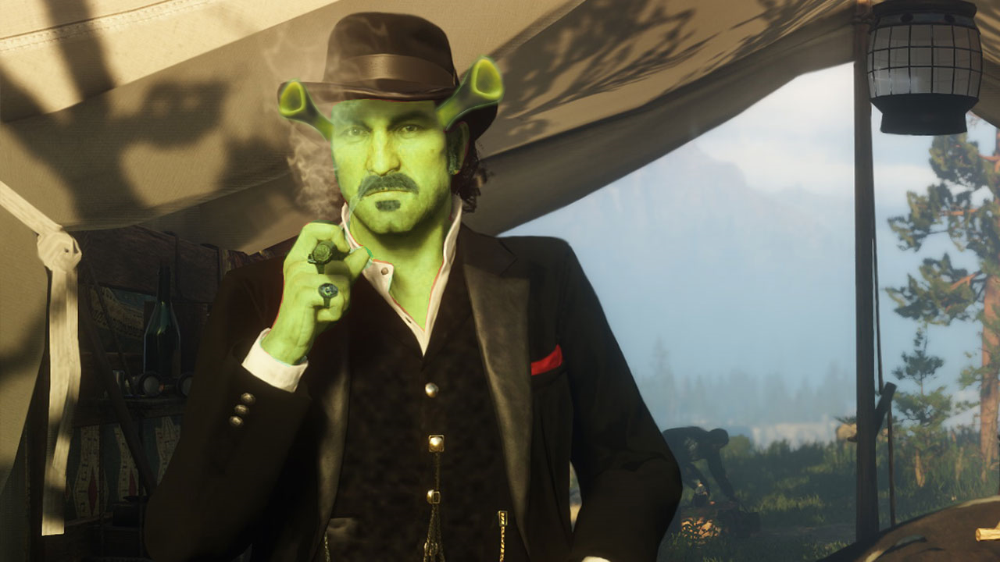

# Chrome Extension to Notify When Rockstar Games' Services Are Back Online  
  
## How to Install Unpacked Version

--- 

- Download zip and extract
- Go to extension page on browser
  -> chrome://extensions
- Enable developer mode (top right)
- Select load unpacked (top left)
- Navigate to the previously extracted folder, and select it!
- Go to Rockstar Games' [services status page](https://support.rockstargames.com/servicestatus)  
- If you want audio and push notifications to work you may need to allow those permissions in the site settings  

---

 
 When the status of a service changes there will be a sound and text notification. Keep in mind that it only works when the Rockstar Games' [services status page](https://support.rockstargames.com/servicestatus) is open. The refresh interval is set to 5 minutes by default and can at the moment only be changed by changing the first two variables in the script.js file.
